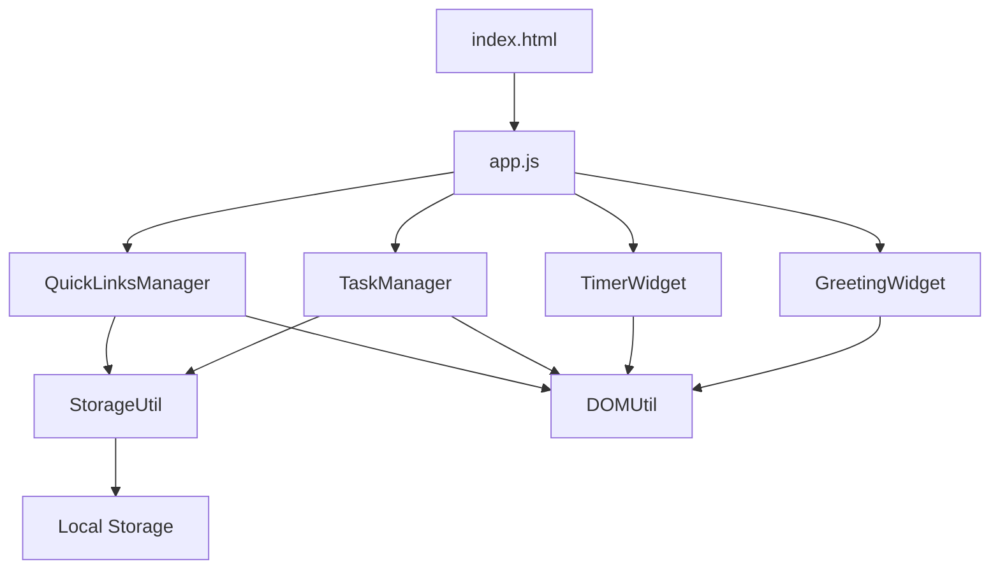
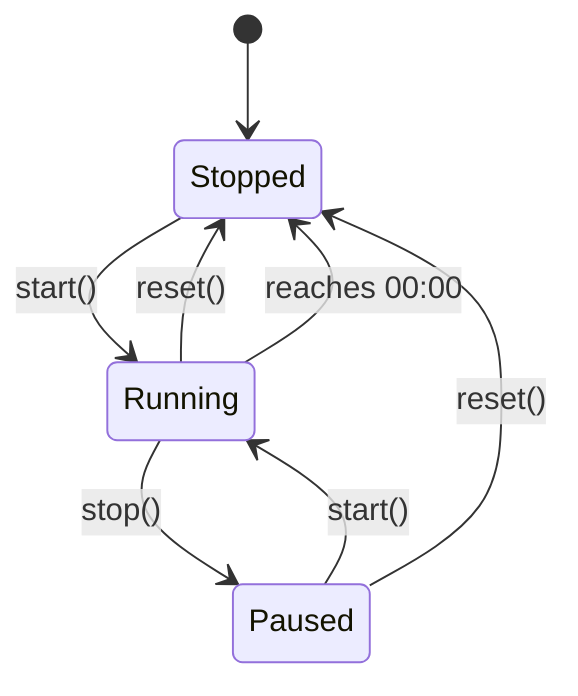

# Design Document: Productivity Dashboard

## Overview

The Productivity Dashboard is a client-side web application that provides essential productivity tools in a single, distraction-free interface. The application consists of four main components: a greeting widget with real-time clock and optional custom name, a 25-minute focus timer, a task management system with sorting capabilities and optional due dates, and a quick links manager. The dashboard supports light and dark themes with user preference persistence. All data persistence is handled through the browser's Local Storage API, eliminating the need for backend infrastructure.

The design prioritizes simplicity and immediate usability. Users can open the HTML file directly in any modern browser and begin using the dashboard without installation, configuration, or network connectivity. The application follows a modular architecture where each widget operates independently while sharing common utilities for storage and DOM manipulation.

### Key Design Principles

1. **Zero Configuration**: The application works immediately upon opening the HTML file
2. **Client-Side Only**: All functionality runs in the browser without server dependencies
3. **Data Persistence**: Local Storage ensures data survives browser sessions
4. **Modular Components**: Each widget is self-contained and independently testable
5. **Progressive Enhancement**: Core functionality works without JavaScript, enhanced with interactivity

## Architecture

### System Architecture

The application follows a simple three-layer architecture:

```
┌─────────────────────────────────────────┐
│         Presentation Layer              │
│  (HTML Structure + CSS Styling)         │
└─────────────────────────────────────────┘
                  │
┌─────────────────────────────────────────┐
│         Application Layer               │
│  ┌──────────┐  ┌──────────┐            │
│  │ Greeting │  │  Timer   │            │
│  │  Widget  │  │  Widget  │            │
│  └──────────┘  └──────────┘            │
│  ┌──────────┐  ┌──────────┐            │
│  │   Task   │  │  Quick   │            │
│  │  Manager │  │  Links   │            │
│  └──────────┘  └──────────┘            │
└─────────────────────────────────────────┘
                  │
┌─────────────────────────────────────────┐
│         Storage Layer                   │
│  (Local Storage API + JSON Serialization)│
└─────────────────────────────────────────┘
```

### Component Interaction

Each widget operates independently but shares common utilities:



### File Structure

```
productivity-dashboard/
├── index.html          # Main HTML structure
├── css/
│   └── styles.css      # All visual styling
└── js/
    └── app.js          # All application logic
```

## Components and Interfaces

### 1. Greeting Widget

**Purpose**: Displays current time, date, time-appropriate greeting message, and optional custom user name.

**Responsibilities**:
- Update time display every second
- Format time in 12-hour format with AM/PM
- Display full date with day of week
- Determine and display appropriate greeting based on current hour
- Display custom user name in greeting when set
- Provide input field for setting custom name
- Persist user name to Local Storage

**Interface**:
```javascript
class GreetingWidget {
  constructor(containerElement, storageKey)
  init()
  updateDisplay()
  getGreeting(hour, userName)
  formatTime(date)
  formatDate(date)
  setUserName(name)
  loadUserName()
  saveUserName()
  destroy()
}
```

**DOM Structure**:
```html
<div class="greeting-widget">
  <div class="time">12:34 PM</div>
  <div class="date">Monday, January 15</div>
  <div class="greeting">Good afternoon, John</div>
  <form class="name-form">
    <input type="text" class="name-input" placeholder="Enter your name (optional)">
    <button type="submit">Save</button>
    <button type="button" class="btn-clear">Clear</button>
  </form>
</div>
```

### 2. Timer Widget

**Purpose**: Provides a 25-minute countdown timer for focused work sessions.

**Responsibilities**:
- Maintain timer state (running, paused, stopped)
- Count down from 25 minutes (1500 seconds)
- Update display every second when running
- Handle start, stop, and reset controls
- Stop automatically at 00:00

**Interface**:
```javascript
class TimerWidget {
  constructor(containerElement)
  init()
  start()
  stop()
  reset()
  tick()
  formatTime(seconds)
  updateDisplay()
  destroy()
}
```

**State Machine**:


**DOM Structure**:
```html
<div class="timer-widget">
  <div class="timer-display">25:00</div>
  <div class="timer-controls">
    <button class="btn-start">Start</button>
    <button class="btn-stop">Stop</button>
    <button class="btn-reset">Reset</button>
  </div>
</div>
```

### 3. Task Manager

**Purpose**: Manages a list of tasks with create, edit, complete, delete, and sort operations, with optional due dates.

**Responsibilities**:
- Add new tasks from user input
- Edit existing task text
- Set and edit task due dates
- Toggle task completion status
- Delete tasks
- Sort tasks by creation date, due date, or alphabetically
- Persist all changes to Local Storage
- Restore tasks from Local Storage on load
- Maintain task order based on selected sort method

**Interface**:
```javascript
class TaskManager {
  constructor(containerElement, storageKey)
  init()
  loadTasks()
  saveTasks()
  addTask(text, dueDate)
  editTask(id, newText)
  setDueDate(id, dueDate)
  toggleTask(id)
  deleteTask(id)
  setSortMethod(method)
  sortTasks(tasks, method)
  renderTasks()
  destroy()
}
```

**DOM Structure**:
```html
<div class="task-manager">
  <form class="task-form">
    <input type="text" class="task-input" placeholder="Add a new task...">
    <input type="date" class="task-date" placeholder="Due date (optional)">
    <button type="submit">Add</button>
  </form>
  <div class="sort-controls">
    <label>Sort by:</label>
    <select class="sort-select">
      <option value="created">Date Created</option>
      <option value="dueDate">Due Date</option>
      <option value="alphabetical">A-Z</option>
    </select>
  </div>
  <ul class="task-list">
    <li class="task-item" data-id="1">
      <input type="checkbox" class="task-checkbox">
      <span class="task-text">Example task</span>
      <span class="task-due-date">Due: Jan 20</span>
      <button class="btn-edit">Edit</button>
      <button class="btn-delete">Delete</button>
    </li>
  </ul>
</div>
```

### 4. Quick Links Manager

**Purpose**: Manages a collection of quick-access links to favorite websites.

**Responsibilities**:
- Add new links with name and URL
- Delete existing links
- Open links in new tabs
- Persist all changes to Local Storage
- Restore links from Local Storage on load

**Interface**:
```javascript
class QuickLinksManager {
  constructor(containerElement, storageKey)
  init()
  loadLinks()
  saveLinks()
  addLink(name, url)
  deleteLink(id)
  openLink(url)
  renderLinks()
  destroy()
}
```

**DOM Structure**:
```html
<div class="quick-links-manager">
  <form class="link-form">
    <input type="text" class="link-name" placeholder="Link name">
    <input type="url" class="link-url" placeholder="https://example.com">
    <button type="submit">Add Link</button>
  </form>
  <div class="links-container">
    <div class="link-item" data-id="1">
      <button class="link-button">Google</button>
      <button class="btn-delete-link">×</button>
    </div>
  </div>
</div>
```

### 5. Theme Manager

**Purpose**: Manages light and dark theme switching with user preference persistence.

**Responsibilities**:
- Toggle between light and dark themes
- Apply theme-specific CSS classes to document
- Persist theme preference to Local Storage
- Restore theme preference on load
- Update toggle button icon based on current theme

**Interface**:
```javascript
class ThemeManager {
  constructor(storageKey)
  init()
  loadTheme()
  saveTheme()
  toggleTheme()
  applyTheme(theme)
  getCurrentTheme()
  destroy()
}
```

**DOM Structure**:
```html
<div class="theme-toggle">
  <button class="btn-theme-toggle" aria-label="Toggle theme">
    <span class="icon-sun">☀️</span>
    <span class="icon-moon">🌙</span>
  </button>
</div>
```

**Theme Application**:
- Light theme: Add `theme-light` class to `<body>`
- Dark theme: Add `theme-dark` class to `<body>`
- CSS variables define colors for each theme

### 6. Storage Utility
    <span class="icon-moon">🌙</span>
  </button>
</div>
```

**Theme Application**:
- Light theme: Add `theme-light` class to `<body>`
- Dark theme: Add `theme-dark` class to `<body>`
- CSS variables define colors for each theme

### 6. Storage Utility

**Purpose**: Provides a consistent interface for Local Storage operations with error handling.

**Responsibilities**:
- Save data to Local Storage with JSON serialization
- Load data from Local Storage with JSON parsing
- Handle storage errors and corrupted data gracefully
- Provide fallback for storage quota exceeded

**Interface**:
```javascript
class StorageUtil {
  static save(key, data)
  static load(key, defaultValue)
  static remove(key)
  static clear()
  static isAvailable()
}
```

### 7. DOM Utility

**Purpose**: Provides helper functions for common DOM manipulation tasks.

**Responsibilities**:
- Create elements with attributes and classes
- Add event listeners with cleanup tracking
- Query elements safely
- Update element content and attributes

**Interface**:
```javascript
class DOMUtil {
  static createElement(tag, attributes, children)
  static query(selector, parent)
  static queryAll(selector, parent)
  static addEventListener(element, event, handler)
  static removeEventListener(element, event, handler)
  static empty(element)
}
```

## Data Models

### Task Model

```javascript
{
  id: string,           // Unique identifier (timestamp-based)
  text: string,         // Task description
  completed: boolean,   // Completion status
  createdAt: number,    // Unix timestamp
  dueDate: string|null  // ISO date string (YYYY-MM-DD) or null
}
```

**Validation Rules**:
- `id`: Must be unique, non-empty string
- `text`: Must be non-empty string after trimming whitespace
- `completed`: Must be boolean
- `createdAt`: Must be positive number
- `dueDate`: Must be valid ISO date string (YYYY-MM-DD) or null

**Storage Format**:
```json
{
  "tasks": [
    {
      "id": "1705334400000",
      "text": "Complete project documentation",
      "completed": false,
      "createdAt": 1705334400000,
      "dueDate": "2024-01-20"
    }
  ]
}
```

### Quick Link Model

```javascript
{
  id: string,    // Unique identifier (timestamp-based)
  name: string,  // Display name for the link
  url: string    // Full URL including protocol
}
```

**Validation Rules**:
- `id`: Must be unique, non-empty string
- `name`: Must be non-empty string after trimming whitespace
- `url`: Must be valid URL string starting with http:// or https://

**Storage Format**:
```json
{
  "quickLinks": [
    {
      "id": "1705334400000",
      "name": "Google",
      "url": "https://www.google.com"
    }
  ]
}
```

### Timer State Model

```javascript
{
  remainingSeconds: number,  // Seconds remaining (0-1500)
  isRunning: boolean,        // Whether timer is actively counting
  intervalId: number|null    // setInterval ID for cleanup
}
```

**State Invariants**:
- `remainingSeconds`: Must be between 0 and 1500 (inclusive)
- `isRunning`: Must be boolean
- `intervalId`: Must be null when not running, number when running

### Theme Preference Model

```javascript
{
  theme: string  // Either "light" or "dark"
}
```

**Validation Rules**:
- `theme`: Must be either "light" or "dark"

**Storage Format**:
```json
{
  "theme": "dark"
}
```

### User Name Model

```javascript
{
  userName: string  // User's custom name for greeting
}
```

**Validation Rules**:
- `userName`: Must be non-empty string after trimming whitespace

**Storage Format**:
```json
{
  "userName": "John"
}
```

### Sort Method Model

```javascript
{
  sortMethod: string  // One of: "created", "dueDate", "alphabetical"
}
```

**Validation Rules**:
- `sortMethod`: Must be one of "created", "dueDate", or "alphabetical"

**Storage Format**:
```json
{
  "sortMethod": "dueDate"
}
```

### Storage Keys

```javascript
const STORAGE_KEYS = {
  TASKS: 'productivity-dashboard-tasks',
  QUICK_LINKS: 'productivity-dashboard-quick-links',
  THEME: 'productivity-dashboard-theme',
  USER_NAME: 'productivity-dashboard-user-name',
  SORT_METHOD: 'productivity-dashboard-sort-method'
};
```


## Correctness Properties

*A property is a characteristic or behavior that should hold true across all valid executions of a system—essentially, a formal statement about what the system should do. Properties serve as the bridge between human-readable specifications and machine-verifiable correctness guarantees.*

### Property 1: Time Format Correctness

*For any* valid Date object, when formatted by the greeting widget, the output string should match the 12-hour time format with AM/PM indicator (e.g., "12:34 PM").

**Validates: Requirements 1.1**

### Property 2: Date Format Completeness

*For any* valid Date object, when formatted by the greeting widget, the output string should contain the day of week, month name, and day number (e.g., "Monday, January 15").

**Validates: Requirements 1.2**

### Property 3: Greeting Correctness

*For any* hour value (0-23), the greeting function should return "Good morning" for hours 5-11, "Good afternoon" for hours 12-16, and "Good evening" for hours 17-23 and 0-4.

**Validates: Requirements 1.3, 1.4, 1.5**

### Property 3a: Greeting with User Name

*For any* hour value (0-23) and any non-empty user name string, the greeting function should return the appropriate time-based greeting followed by a comma and the user name (e.g., "Good morning, John").

**Validates: Requirements 1.7**

### Property 3b: Greeting without User Name

*For any* hour value (0-23) and null or empty user name, the greeting function should return only the time-based greeting without appending a name.

**Validates: Requirements 1.8**

### Property 4: Timer Display Format

*For any* number of seconds between 0 and 1500 (inclusive), the timer display format should be MM:SS where MM is zero-padded minutes and SS is zero-padded seconds.

**Validates: Requirements 2.5**

### Property 5: Timer Start Preserves Remaining Time

*For any* timer state with remaining seconds, starting the timer should not change the remaining seconds value, only the running state.

**Validates: Requirements 2.2**

### Property 6: Timer Stop Preserves Remaining Time

*For any* running timer state, stopping the timer should preserve the current remaining seconds value while changing the running state to false.

**Validates: Requirements 2.3**

### Property 7: Timer Reset Restores Initial State

*For any* timer state (running or stopped, any remaining time), resetting should set remaining seconds to 1500 and running state to false.

**Validates: Requirements 2.4**

### Property 8: Task Addition Preserves Text

*For any* non-empty task text string, adding it to the task list should create a task where the task's text property equals the input text (after trimming).

**Validates: Requirements 3.1**

### Property 9: Task Edit Updates Text

*For any* existing task and any new non-empty text string, editing the task should update the task's text property to the new text (after trimming).

**Validates: Requirements 3.2**

### Property 10: Task Toggle Round-Trip

*For any* task, toggling its completion status twice should return it to its original completion state.

**Validates: Requirements 3.3**

### Property 11: Task Deletion Removes Task

*For any* task list and any task ID in that list, deleting the task should result in a list that does not contain that task ID.

**Validates: Requirements 3.4**

### Property 12: Task Order Preservation

*For any* sequence of task additions, the order of tasks in the task list should match the order in which they were added (creation order).

**Validates: Requirements 3.5**

### Property 13: Task Completion Status Visibility

*For any* task, the DOM representation should have a distinguishing attribute or class that reflects its completion status (completed tasks marked differently from incomplete tasks).

**Validates: Requirements 3.6**

### Property 14: Task Storage Round-Trip

*For any* valid task list, saving to Local Storage and then loading should produce an equivalent task list with the same tasks in the same order with the same properties.

**Validates: Requirements 3.7, 3.8, 5.1, 5.4, 5.6**

### Property 15: Quick Link Addition Preserves Data

*For any* non-empty name and valid URL, adding a quick link should create a link where the name and URL properties match the input values (after trimming).

**Validates: Requirements 4.1**

### Property 16: Quick Link Rendering

*For any* quick link, the DOM representation should include a clickable button element with the link's name as the button text.

**Validates: Requirements 4.3**

### Property 17: Quick Link Deletion Removes Link

*For any* quick links list and any link ID in that list, deleting the link should result in a list that does not contain that link ID.

**Validates: Requirements 4.4**

### Property 18: Quick Link Storage Round-Trip

*For any* valid quick links list, saving to Local Storage and then loading should produce an equivalent list with the same links in the same order with the same properties.

**Validates: Requirements 4.5, 4.6, 5.2, 5.5, 5.6**

### Property 19: Corrupted Storage Graceful Handling

*For any* invalid JSON string or data structure that doesn't match the expected schema, attempting to load from Local Storage should return an empty array without throwing an error.

**Validates: Requirements 5.3**

### Property 20: Theme Toggle Alternation

*For any* current theme state (light or dark), toggling the theme should switch to the opposite theme.

**Validates: Requirements 10.2**

### Property 21: Theme Storage Round-Trip

*For any* valid theme value ("light" or "dark"), saving to Local Storage and then loading should produce the same theme value.

**Validates: Requirements 10.5, 10.6**

### Property 22: Theme Default Value

*When* no theme preference is stored in Local Storage, loading the theme should return "light" as the default value.

**Validates: Requirements 10.7**

### Property 23: User Name Storage Round-Trip

*For any* non-empty user name string, saving to Local Storage and then loading should produce the same user name (after trimming).

**Validates: Requirements 11.2, 11.3**

### Property 24: User Name Trimming

*For any* user name string with leading or trailing whitespace, saving the user name should store the trimmed version.

**Validates: Requirements 11.7**

### Property 25: Task Due Date Preservation

*For any* task with a due date, adding the task and then retrieving it should preserve the due date value.

**Validates: Requirements 3.9, 3.10**

### Property 26: Sort by Creation Date Order

*For any* sequence of task additions, when sorted by creation date, tasks should appear in the order they were created (earliest first).

**Validates: Requirements 12.2**

### Property 27: Sort by Due Date Order

*For any* list of tasks with due dates, when sorted by due date, tasks should appear with earliest due dates first, and tasks without due dates should appear last.

**Validates: Requirements 12.3, 12.5**

### Property 28: Sort Alphabetically Order

*For any* list of tasks, when sorted alphabetically, tasks should appear in ascending alphabetical order by task text (case-insensitive).

**Validates: Requirements 12.4**

### Property 29: Sort Method Storage Round-Trip

*For any* valid sort method ("created", "dueDate", "alphabetical"), saving to Local Storage and then loading should produce the same sort method value.

**Validates: Requirements 12.6, 12.7**

### Property 30: Sort Method Default Value

*When* no sort method is stored in Local Storage, loading the sort method should return "created" as the default value.

**Validates: Requirements 12.8**

## Error Handling

### Storage Errors

**Quota Exceeded**:
- When Local Storage quota is exceeded during save operations, catch the `QuotaExceededError`
- Display a user-friendly message indicating storage is full
- Suggest clearing old data or using browser settings to increase quota
- Continue operation without crashing (fail gracefully)

**Corrupted Data**:
- When loading data from Local Storage, wrap JSON.parse in try-catch
- If parsing fails, log error to console and return default empty state
- Initialize with empty task list and empty quick links
- Do not prevent application from loading

**Storage Unavailable**:
- Check for Local Storage availability on initialization
- If unavailable (private browsing, disabled), display warning message
- Allow application to function with in-memory state only
- Warn user that data will not persist across sessions

### Input Validation Errors

**Empty Task Text**:
- Trim input before validation
- Reject empty strings or whitespace-only strings
- Display inline validation message
- Do not add task to list
- Keep input field focused for correction

**Invalid URL Format**:
- Validate URL format before adding quick link
- Require http:// or https:// protocol
- Display inline validation message for invalid URLs
- Do not add link to list
- Keep input field focused for correction

**Missing Required Fields**:
- Validate that both name and URL are provided for quick links
- Display specific message indicating which field is missing
- Prevent form submission until all required fields are filled

**Invalid Due Date**:
- Validate date format before adding to task
- Accept only valid ISO date strings (YYYY-MM-DD)
- Display inline validation message for invalid dates
- Allow empty/null due date (optional field)

**Invalid Sort Method**:
- Validate sort method is one of: "created", "dueDate", "alphabetical"
- Default to "created" if invalid value encountered
- Log warning for invalid sort method values

### Theme Errors

**Invalid Theme Value**:
- Validate theme is either "light" or "dark"
- Default to "light" if invalid value encountered in storage
- Log warning for invalid theme values
- Always maintain valid theme state

**Theme Application Failure**:
- Ensure body element exists before applying theme class
- Fallback to inline styles if CSS classes fail to load
- Continue operation even if theme styling fails

### Timer Errors

**Invalid State Transitions**:
- Prevent starting an already running timer (no-op)
- Prevent stopping an already stopped timer (no-op)
- Ensure reset always returns to valid initial state regardless of current state

**Interval Cleanup**:
- Always clear interval when stopping or resetting timer
- Store interval ID for proper cleanup
- Prevent memory leaks from orphaned intervals
- Clear interval on component destroy

### DOM Errors

**Missing Elements**:
- Check for container element existence before initialization
- Throw descriptive error if required container not found
- Validate element selectors before querying
- Provide fallback for missing optional elements

**Event Listener Cleanup**:
- Track all event listeners for proper cleanup
- Remove listeners on component destroy
- Prevent memory leaks from orphaned listeners
- Use event delegation where appropriate to minimize listeners

## Testing Strategy

### Overview

The testing strategy employs a dual approach combining unit tests for specific examples and edge cases with property-based tests for universal correctness guarantees. This ensures both concrete behavior validation and comprehensive input coverage.

### Unit Testing

Unit tests focus on:
- **Specific Examples**: Concrete test cases that demonstrate correct behavior (e.g., "Good morning" at 9 AM)
- **Edge Cases**: Boundary conditions (e.g., timer at 00:00, empty task list, midnight hour transitions)
- **Error Conditions**: Invalid inputs and error handling (e.g., corrupted JSON, storage quota exceeded)
- **Integration Points**: Component interactions (e.g., storage utility integration, DOM manipulation)

**Unit Test Examples**:
```javascript
// Example: Specific greeting at specific time
test('displays "Good morning" at 9 AM', () => {
  const greeting = getGreeting(9);
  expect(greeting).toBe('Good morning');
});

// Edge case: Timer at zero
test('timer stops at 00:00', () => {
  const timer = new TimerWidget(container);
  timer.remainingSeconds = 0;
  timer.tick();
  expect(timer.isRunning).toBe(false);
});

// Error condition: Corrupted storage
test('handles corrupted JSON gracefully', () => {
  localStorage.setItem('tasks', 'invalid-json{');
  const tasks = StorageUtil.load('tasks', []);
  expect(tasks).toEqual([]);
});
```

### Property-Based Testing

Property-based tests verify universal properties across randomly generated inputs. Each test runs a minimum of 100 iterations to ensure comprehensive coverage.

**Framework**: Use **fast-check** for JavaScript property-based testing.

**Configuration**:
```javascript
import fc from 'fast-check';

// Minimum 100 iterations per property test
const config = { numRuns: 100 };
```

**Property Test Structure**:
```javascript
// Feature: productivity-dashboard, Property 1: Time Format Correctness
test('time format is always HH:MM AM/PM', () => {
  fc.assert(
    fc.property(
      fc.date(), // Generate random dates
      (date) => {
        const formatted = formatTime(date);
        const pattern = /^\d{1,2}:\d{2} (AM|PM)$/;
        expect(formatted).toMatch(pattern);
      }
    ),
    config
  );
});

// Feature: productivity-dashboard, Property 14: Task Storage Round-Trip
test('task storage round-trip preserves data', () => {
  fc.assert(
    fc.property(
      fc.array(fc.record({
        id: fc.string(),
        text: fc.string().filter(s => s.trim().length > 0),
        completed: fc.boolean(),
        createdAt: fc.nat()
      })),
      (tasks) => {
        StorageUtil.save('test-tasks', tasks);
        const loaded = StorageUtil.load('test-tasks', []);
        expect(loaded).toEqual(tasks);
      }
    ),
    config
  );
});
```

**Custom Generators**:
```javascript
// Generate valid task objects
const taskArbitrary = fc.record({
  id: fc.string().filter(s => s.length > 0),
  text: fc.string().filter(s => s.trim().length > 0),
  completed: fc.boolean(),
  createdAt: fc.nat(),
  dueDate: fc.option(fc.date().map(d => d.toISOString().split('T')[0]))
});

// Generate valid quick link objects
const quickLinkArbitrary = fc.record({
  id: fc.string().filter(s => s.length > 0),
  name: fc.string().filter(s => s.trim().length > 0),
  url: fc.webUrl()
});

// Generate hours (0-23)
const hourArbitrary = fc.integer({ min: 0, max: 23 });

// Generate timer seconds (0-1500)
const timerSecondsArbitrary = fc.integer({ min: 0, max: 1500 });

// Generate theme values
const themeArbitrary = fc.constantFrom('light', 'dark');

// Generate user names
const userNameArbitrary = fc.string().filter(s => s.trim().length > 0);

// Generate sort methods
const sortMethodArbitrary = fc.constantFrom('created', 'dueDate', 'alphabetical');

// Generate ISO date strings
const isoDateArbitrary = fc.date().map(d => d.toISOString().split('T')[0]);
```

### Property Test Coverage

Each correctness property from the design document must be implemented as a property-based test:

1. **Property 1**: Time format correctness → Test with random dates
2. **Property 2**: Date format completeness → Test with random dates
3. **Property 3**: Greeting correctness → Test with random hours (0-23)
4. **Property 3a**: Greeting with user name → Test with random hours and user names
5. **Property 3b**: Greeting without user name → Test with random hours and null/empty names
6. **Property 4**: Timer display format → Test with random seconds (0-1500)
7. **Property 5**: Timer start preserves time → Test with random timer states
8. **Property 6**: Timer stop preserves time → Test with random running states
9. **Property 7**: Timer reset restores initial → Test with random timer states
10. **Property 8**: Task addition preserves text → Test with random task texts
11. **Property 9**: Task edit updates text → Test with random tasks and new texts
12. **Property 10**: Task toggle round-trip → Test with random tasks
13. **Property 11**: Task deletion removes task → Test with random task lists
14. **Property 12**: Task order preservation → Test with random task sequences
15. **Property 13**: Task completion visibility → Test with random tasks
16. **Property 14**: Task storage round-trip → Test with random task lists
17. **Property 15**: Quick link addition → Test with random names and URLs
18. **Property 16**: Quick link rendering → Test with random quick links
19. **Property 17**: Quick link deletion → Test with random link lists
20. **Property 18**: Quick link storage round-trip → Test with random link lists
21. **Property 19**: Corrupted storage handling → Test with random invalid JSON
22. **Property 20**: Theme toggle alternation → Test with random theme states
23. **Property 21**: Theme storage round-trip → Test with random theme values
24. **Property 22**: Theme default value → Test with empty storage
25. **Property 23**: User name storage round-trip → Test with random user names
26. **Property 24**: User name trimming → Test with random whitespace-padded names
27. **Property 25**: Task due date preservation → Test with random tasks with due dates
28. **Property 26**: Sort by creation date order → Test with random task sequences
29. **Property 27**: Sort by due date order → Test with random tasks with/without due dates
30. **Property 28**: Sort alphabetically order → Test with random task texts
31. **Property 29**: Sort method storage round-trip → Test with random sort methods
32. **Property 30**: Sort method default value → Test with empty storage

### Test Organization

```
tests/
├── unit/
│   ├── greeting-widget.test.js
│   ├── timer-widget.test.js
│   ├── task-manager.test.js
│   ├── quick-links-manager.test.js
│   ├── theme-manager.test.js
│   ├── storage-util.test.js
│   └── dom-util.test.js
└── properties/
    ├── greeting-properties.test.js
    ├── timer-properties.test.js
    ├── task-properties.test.js
    ├── quick-links-properties.test.js
    ├── theme-properties.test.js
    └── storage-properties.test.js
```

### Testing Balance

- **Unit tests**: Focus on 10-15 tests per component covering examples, edge cases, and error conditions
- **Property tests**: Implement all 32 properties from the design document
- **Avoid over-testing**: Don't write unit tests for cases already covered by property tests
- **Integration tests**: Minimal - focus on component initialization and cleanup

### Test Execution

```bash
# Run all tests
npm test

# Run only unit tests
npm test -- unit/

# Run only property tests
npm test -- properties/

# Run with coverage
npm test -- --coverage
```

### Continuous Integration

- Run all tests on every commit
- Require 80% code coverage minimum
- Property tests must pass all 100 iterations
- No failing tests allowed in main branch

---

## Implementation Notes

### Browser Compatibility Considerations

- Use `const` and `let` instead of `var` (supported in all target browsers)
- Use template literals for string formatting (supported in all target browsers)
- Use arrow functions (supported in all target browsers)
- Use `Array.prototype.find`, `filter`, `map` (supported in all target browsers)
- Avoid async/await if not necessary (use Promises if needed)
- Test Local Storage availability before use

### Performance Optimizations

- Debounce storage operations if user makes rapid changes
- Use event delegation for task and link lists to minimize event listeners
- Cache DOM queries where appropriate
- Minimize DOM reflows by batching updates
- Use `requestAnimationFrame` for timer updates if needed for smoother display

### Accessibility Considerations

- Use semantic HTML elements (header, main, section, article)
- Provide ARIA labels for icon buttons
- Ensure keyboard navigation works for all interactive elements
- Use sufficient color contrast for text
- Provide focus indicators for all interactive elements
- Use proper heading hierarchy (h1, h2, h3)

### Security Considerations

- Sanitize user input before rendering to DOM (prevent XSS)
- Validate URLs before opening in new tabs
- Use `rel="noopener noreferrer"` for external links
- Limit Local Storage data size to prevent quota issues
- Handle storage errors gracefully without exposing sensitive information

### Future Enhancements

Potential features for future iterations:
- Task categories or tags
- Task reminders and notifications
- Timer sound notification when complete
- Multiple timer presets (15, 25, 45 minutes)
- Export/import tasks and links
- Keyboard shortcuts for common actions
- Task search and filtering
- Statistics and productivity tracking
- Recurring tasks
- Task priority levels

